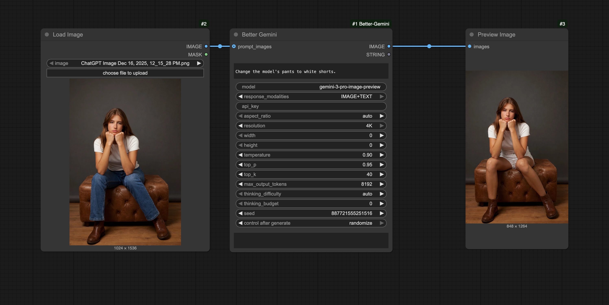

# ComfyUI Better Gemini

Custom ComfyUI node(s) for generating images with Google Gemini via the official `google-genai` Python SDK.

## Install

1. Clone into your ComfyUI `custom_nodes` directory:
   - `cd /path/to/ComfyUI/custom_nodes`
   - `git clone https://github.com/<you>/ComfyUI-Better-Gemini.git`
2. Install Python deps (network required):
   - `pip install -r ComfyUI-Better-Gemini/requirements.txt`
3. Set an API key (recommended):
   - `export GOOGLE_API_KEY="..."` (or `GEMINI_API_KEY`)
4. Restart ComfyUI.

## Nodes

- `Better Gemini` (image)
  - Inputs: prompt, model, prompt_images (optional), aspect ratio, resolution / width+height, temperature, top_p/top_k, max tokens, thinking difficulty, seed.
  - Outputs: `IMAGE`, `STRING` (any returned text / notes).

## Example Workflow

## Notes

- The node imports `google-genai` lazily so ComfyUI can still boot even if dependencies aren’t installed yet; execution will raise a clear error until installed.
- This extension uses ComfyUI’s V3 extension loader (`comfy_entrypoint`).
- Gemini requires `seed` to fit in an `int32`; larger ComfyUI seeds are deterministically folded via `seed % 2**31`.
- Gemini image-preview models often return a fixed base image size; `resolution`/`width`+`height` are best-effort and the node logs a warning if the returned size doesn’t match (no auto-resize).

## Dev

- Run unit tests: `python -m unittest discover -s tests -p 'test_*.py' -v`
