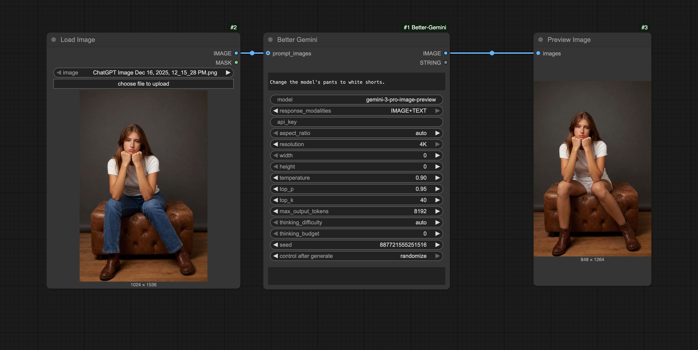

# ComfyUI Better Gemini

Custom ComfyUI node(s) for generating images with Google Gemini and xAI Grok.

## Install

1. Clone into your ComfyUI `custom_nodes` directory:
   - `cd /path/to/ComfyUI/custom_nodes`
   - `git clone https://github.com/<you>/ComfyUI-Better-Gemini.git`
2. Install Python deps with `uv` (network required):
   - `uv sync`
   - `uv pip install --python /path/to/ComfyUI/python/bin/python -e ./ComfyUI-Better-Gemini`
3. Set API keys as needed:
   - `export GOOGLE_API_KEY="..."` (or `GEMINI_API_KEY`) for Gemini
   - `export XAI_API_KEY="..."` for Grok
4. Restart ComfyUI.

## Nodes

- `Better Gemini` (image)
  - Inputs: prompt, model (dropdown; populated via `models.list()`), prompt_images (optional), aspect ratio, resolution / width+height, temperature, top_p/top_k, max tokens, thinking difficulty, seed.
  - Outputs: `IMAGE`, `STRING` (any returned text / notes).
- `Better Grok` (image)
  - Inputs: prompt, model (dropdown; populated via `/v1/image-generation-models` when `XAI_API_KEY` is available), prompt_images (optional), aspect ratio, resolution, `n`.
  - Outputs: `IMAGE`, `STRING` (status / notes).

## Example Workflow

## Notes

- The Gemini node imports `google-genai` lazily so ComfyUI can still boot even if dependencies aren’t installed yet; execution will raise a clear error until installed.
- This extension uses ComfyUI’s V3 extension loader (`comfy_entrypoint`).
- The Gemini `model` dropdown is populated via `client.models.list()` (filtered to models supporting `generateContent`). It requires an API key via `GOOGLE_API_KEY`/`GEMINI_API_KEY`; otherwise it falls back to bundled defaults and logs a warning: `gemini-3.1-flash-image-preview`, `gemini-3-pro-image-preview`, `imagen-4.0-generate-001`, `imagen-4.0-ultra-generate-001`.
- The Grok `model` dropdown is populated via xAI’s `/v1/image-generation-models`. It requires `XAI_API_KEY`; otherwise it falls back to bundled defaults and logs a warning: `grok-imagine-image`, `grok-imagine-image-pro`.
- Gemini requires `seed` to fit in an `int32`; larger ComfyUI seeds are deterministically folded via `seed % 2**31`.
- Grok image generation is wired against xAI’s documented image endpoints and requests `response_format="b64_json"`, so the node can return image tensors directly instead of downloading temporary URLs.
- Grok image edits use xAI’s JSON-based `/v1/images/edits` API and send ComfyUI `IMAGE` inputs as PNG data URIs. Multiple prompt images are supported for edit/merge workflows.
- `resolution`/`aspect_ratio` are best-effort (model-dependent). The node logs a warning if the returned size doesn’t match (no auto-resize).
- If Gemini or Grok returns no images, the node returns a blank placeholder image and includes a note in the `STRING` output.

## Dev

- Sync dev environment: `uv sync --dev`
- Run unit tests: `uv run python -m unittest discover -s tests -p 'test_*.py' -v`
